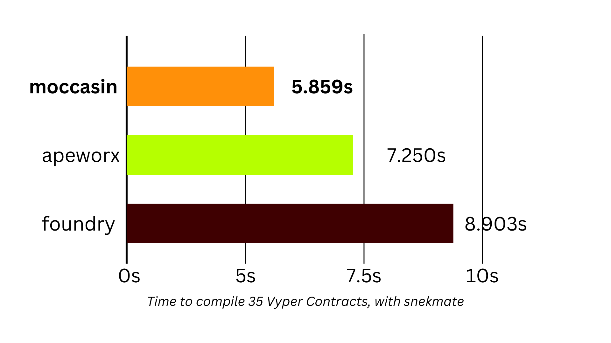
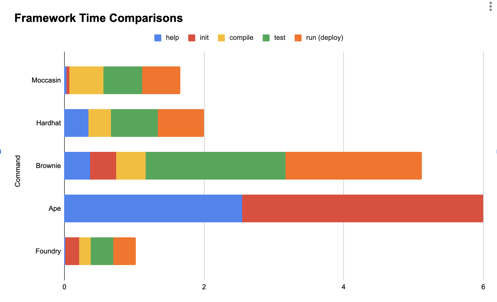

> This tool is in beta, use at your own risk

<p align="center">
    <br />
        </a>
    <br />
</p>


# Moccasin

A fast, pythonic, Vyper smart contract testing and development framework.

[](https://github.com/astral-sh/uv)
[](https://pypi.org/project/moccasin/)
[](https://pypi.python.org/pypi/moccasin)
[](https://pypi.python.org/pypi/moccasin)

> The smaller bar is better, it means it's faster

<p align="center">
  <picture align="center">
    <source media="(prefers-color-scheme: dark)" srcset="./docs/source/_static/stats-dark.png" width=70%>
    <source media="(prefers-color-scheme: light)" srcset="./docs/source/_static/stats-light.png" width=70%>
    
  </picture>
</p>

_You can see how we conducted these tests from the [benchmarking repo](https://github.com/PatrickAlphaC/benchmarking-frameworks)._

Fast to install, test, and run python commands on your smart contracts.

# Highlights

- 🐍 Pythonic start to finish, built on top of Vyper's [titanoboa](https://titanoboa.readthedocs.io/en/latest/)
- 🔐 ZKsync built-in support
- 📑 Named Contracts allow you to define smart contract addresses without scaffolding anything yourself
- 🧪 Custom staging pytest markers so you can run tests anywhere, anyhow
- 🦊 Support for encrypting wallets, no private keys in `.env` files! 
- 🧳 GitHub and Python smart contract dependency installation 

# Quickstart

Head over to [the moccasin installation documentation](https://cyfrin.github.io/moccasin/installing_moccasin.html) to for other install methodologies and getting stated.

## This README Quickstart

To install the moccasin `mox` command, we recommend the [uv](https://docs.astral.sh/uv/) tool.

```bash
uv tool install moccasin --prerelease=allow
```

Then, see a list of commands with:

```bash
mox --help
```

# Documentation

You can view the documentation [here](https://cyfrin.github.io/moccasin/).

# Contributing

If you're interested in helping build moccasin, please see the [contributing guide](./CONTRIBUTING.md).

# Help output

```bash
mox --help
usage: Moccasin CLI [-h] [-d] [-q]
                    {init,compile,build,test,run,script,deploy,wallet,console,install,purge,config,explorer,inspect,deployments,utils,u,util}
                    ...

🐍 Pythonic Smart Contract Development Framework

positional arguments:
  {init,compile,build,test,run,script,deploy,wallet,console,install,purge,config,explorer,inspect,deployments,utils,u,util}
    init                Initialize a new project.
    compile (build)     Compiles the project.
    test                Runs all tests in the project.
    run (script)        Runs a script with the project's context.
    deploy              Deploys a contract named in the config with a deploy script.
    wallet              Wallet management utilities.
    console             BETA, USE AT YOUR OWN RISK: Interact with the network in a python shell.
    install             Installs the project's dependencies.
    purge               Purge a given dependency
    config              View the Moccasin configuration.
    explorer            Work with block explorers to get data.
    inspect             Inspect compiler data of a contract.
    deployments         View deployments of the project from your DB.
    utils (u, util)     Helpful utilities - right now it's just the one.

options:
  -h, --help            show this help message and exit
  -d, --debug           Run in debug mode
  -q, --quiet           Suppress all output except errors
```

# Acknowledgements 

- [brownie](https://github.com/eth-brownie/brownie)
- [vyper](https://github.com/vyperlang/vyper)
- [boa](https://github.com/vyperlang/titanoboa)

## Background

> Agkistrodon piscivorus is a species of venomous snake, a pit viper in the subfamily Crotalinae of the family Viperidae. The generic name is derived from the Greek words ἄγκιστρον agkistron "fish-hook, hook" and ὀδών odon "tooth", and the specific name comes from the Latin piscis 'fish' and voro '(I) eat greedily, devour'; thus, the scientific name translates to "hook-toothed fish-eater". Common names include cottonmouth, northern cottonmouth, water moccasin, swamp moccasin, black moccasin, and simply viper.

# More Stats

<p align="center">
    <br />
    <a href="https://cyfrin.io/">
        </a>
    <br />
</p>

# License 

moccasin is licensed under either of:

- Apache License, Version 2.0, (LICENSE-APACHE or https://www.apache.org/licenses/LICENSE-2.0)
- MIT license (LICENSE-MIT or https://opensource.org/licenses/MIT)

at your option.

Unless you explicitly state otherwise, any contribution intentionally submitted for inclusion in moccasin by you, as defined in the Apache-2.0 license, shall be dually licensed as above, without any additional terms or conditions.
