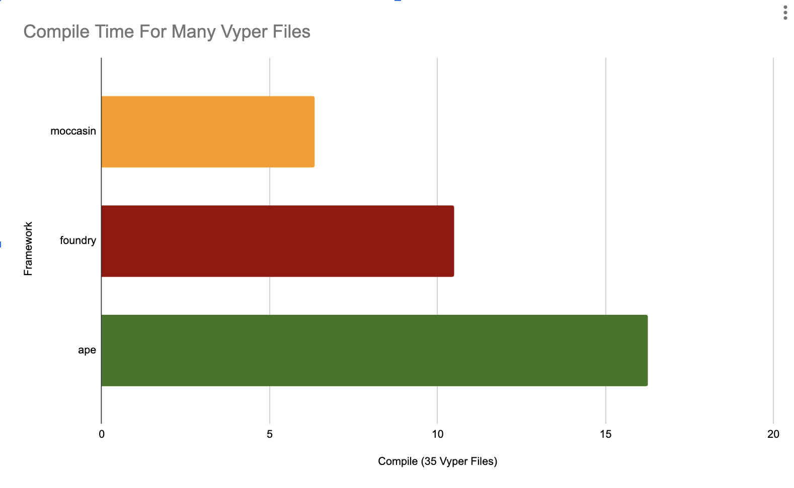

> This tool is in beta, use at your own risk

<p align="center">
    <br />
        </a>
    <br />
</p>

# Moccasin

A fast, pythonic, Vyper smart contract testing and development framework.

[](https://github.com/astral-sh/uv)

> The smaller bar is better, it means it's faster

<p align="center">
    <br />
    <a href="https://cyfrin.io/">
        </a>
    <br />
</p>

_You can see how we conducted these tests from the [benchmarking repo](https://github.com/PatrickAlphaC/benchmarking-frameworks)._

Fast to install, test, and run python commands on your smart contracts.

# Quickstart

Head over to [the moccasin installation documentation](https://cyfrin.github.io/moccasin/installing_moccasin.html) to for other install methodologies and getting stated.

## This README Quickstart

To install the moccasin `mox` command, we recommend the [uv](https://docs.astral.sh/uv/) tool.

```bash
uv tool install moccasin
```

Then, see a list of commands with:

```bash
mox --help
```

# Documentation

The documentation roughly attempts to follow [Diátaxis](https://diataxis.fr/).

# Acknowledgements 

- [brownie](https://github.com/eth-brownie/brownie)
- [vyper](https://github.com/vyperlang/vyper)
- [boa](https://github.com/vyperlang/titanoboa)

## Background

> Agkistrodon piscivorus is a species of venomous snake, a pit viper in the subfamily Crotalinae of the family Viperidae. The generic name is derived from the Greek words ἄγκιστρον agkistron "fish-hook, hook" and ὀδών odon "tooth", and the specific name comes from the Latin piscis 'fish' and voro '(I) eat greedily, devour'; thus, the scientific name translates to "hook-toothed fish-eater". Common names include cottonmouth, northern cottonmouth, water moccasin, swamp moccasin, black moccasin, and simply viper.

# More Stats

<p align="center">
    <br />
    <a href="https://cyfrin.io/">
        </a>
    <br />
</p>

# License 

moccasin is licensed under either of:

- Apache License, Version 2.0, (LICENSE-APACHE or https://www.apache.org/licenses/LICENSE-2.0)
- MIT license (LICENSE-MIT or https://opensource.org/licenses/MIT)

at your option.

Unless you explicitly state otherwise, any contribution intentionally submitted for inclusion in moccasin by you, as defined in the Apache-2.0 license, shall be dually licensed as above, without any additional terms or conditions.
